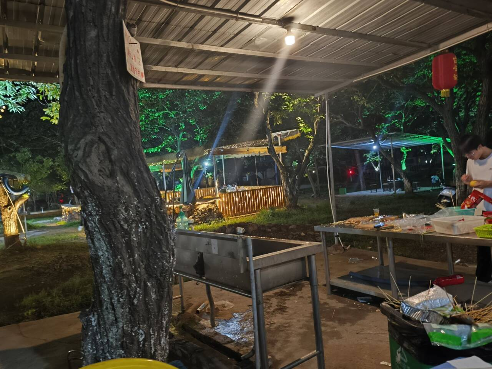
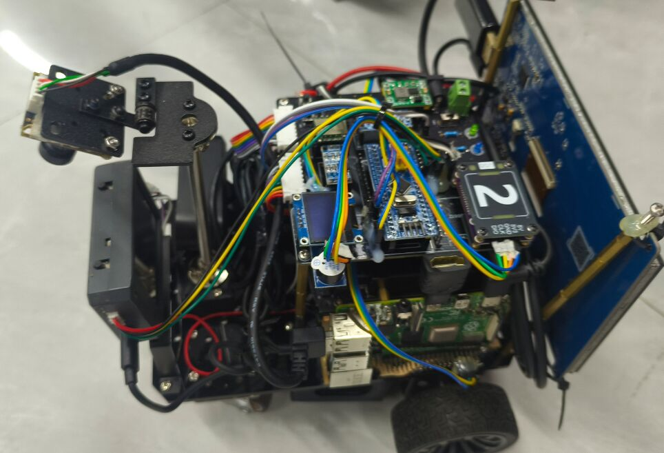
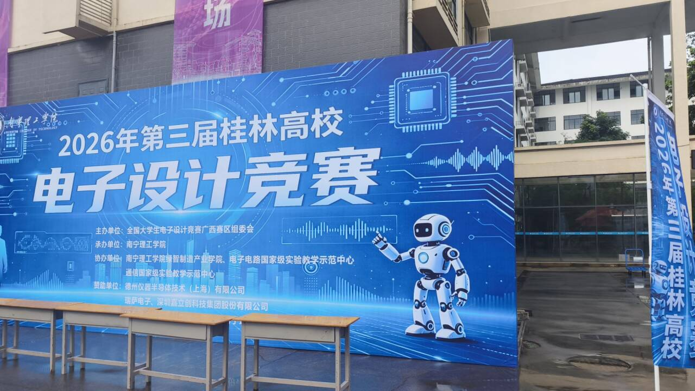

## 前言

对于上一次月记来说，很久没有写一次月记了，因为各种事情太过于繁忙。但我觉得还是不得不回来聚焦这些我需要去做的事情，以及去回顾一下过去我做了哪些事情，这个是非常有必要的。

## 遥测团建

对于在五一的一年一度团建，每年都是比较期待的一个环节，大家一起出去玩的感觉体验很不一样，总让我恍惚想起高中——只不过那些日子早就翻篇了。出发前一天我们就分配好了各自的任务--五一早上要买什么烧烤石材，早上7点半出发去买石材，然后一起带到山庄放好准备，后面就是清理，串，到中午我们的烧烤盛宴就正式开始了，大家团团围在炕上，给烧烤刷佐料并讨论生活琐事，你一句我一句，觥筹交错，都开开心心。之后就是吃饱喝足，慢悠悠的娱乐时光，可以下棋，打牌，打球之类，或者说躺在草地上睡上个午觉还是很舒服的，逐渐到傍晚，我们吃完晚餐，各自道谢回去休息来。,本次团建总体来说是成功，当时正值与电赛出题后的几天，把那阵子的紧绷感卸掉了不少，也在我记忆增添来浓厚的一笔。

## 电赛校赛测评

对于本次校赛，一波三折，看到题目的时候，面对题目不知道选哪个题目，因为都是没有做过的，最终我们选择了H题视觉引导小车，当时我们是一点思路都没有，需要完全的视觉来实现基本功能，这是没有接触过的东西。但我直觉告诉我做这个，因为有学习了一点视觉，灵感上有了一点思路。拆分完题目，列出要实现的功能，我们就开始着手。

由于初期我们选择方案的时候浪费了很多时间，因为有方案要去测试完才能知道能不能行，加上红绿灯和牌子的设计，我们前两个星期都在测试和等待快递的过程。那就还剩一个星期了，当时我队友他丢下一句：还有一个星期了，直接干，翘课都要搞出来。"，这句话确实鼓动了我。因此当时我们的进度还是非常紧张的，一个星期，面临测评的前一天才把模块效果实现，效果调得差不多，当时都准备熬一夜来调试使效果最佳，以防测评出问题。但最后突然收到的通知--延期一个星期后测评，我和队友突然紧绷的弦才逐渐放松下来，虽然一个星期要上课，但也足以调试完善。

比赛现场，虽然经历过一次，但还是非常紧张。调试的时候，由于环境对视觉的干扰是很有影响的，我们尽可能选择好的场地并排除环境因素。对于我们的小车，方案是比较新颖，有很多人来观看，加上测评老师，压迫感还是很大的，心里不免更加紧张了。最终，测评出了点小意外，但效果最后还是实现了，虚惊一场。自此，校赛完美落幕。

## 高校赛

本次高校赛是桂林举办的第三届桂林高校电子设计竞赛，虽然说去年作为大一小登，有幸去了一次，当时刚刚入门，测评运气好被选上,看到了各学校的优秀作品，对我的冲击还是很大的，原来电赛还可以这么好玩，小车还可以长这么帅，内心想学习更多nb知识的种子渐渐种下。对于上次校赛测评，我们组还是取得了不错的成绩，被学校推举到了高校赛，还是有点受宠若惊。

之后我们再调试下小车继续优化，就直接准备出发了。到了现场，我还是比较新奇，带着队友左看看，右看看。后面放完东西，休息了一下，就准备测评了，依旧有惊无险，基本完成了要求。我们测完后，就去看其他队的作品了，感受还是很多的。到了中午，我们就吃饭了，南宁理工的食堂还是比较好吃的，赞。接下来下午就是颁奖仪式了，幸运的获得了一等奖，得了个小蓝牙音响。

本次高校赛，算是弥补了去年的遗憾吧，对于去年来说也看到了自己的成长和进步。

## 小结

对于上个月的我来说，学到了很多。

我逐渐在学习的过程中跨越了一座座山顶，到最后终于明白自己有太多东西需要学习。越到后面，发现要学的东西越来越难，越来越多，未来的规划也逐渐迷茫了。

关于梦想，我的梦想是什么？小时候的梦想是成为一名伟大的科学家，要留名青史。但越是长大，就越感觉到有一些对我很重要的东西被剥夺，认知逐渐降低。我不想讨论一些关于目的、意义和存在的宏大话题，也可能要暂时抛开对人生价值与真理的追求。因为我的故事还没有结束，还需要收起我的“感慨万千”继续前进。

至于到底有什么感想，百闻不如一见。

愿本次区赛能拥有一个不留遗憾的青春，加油。

