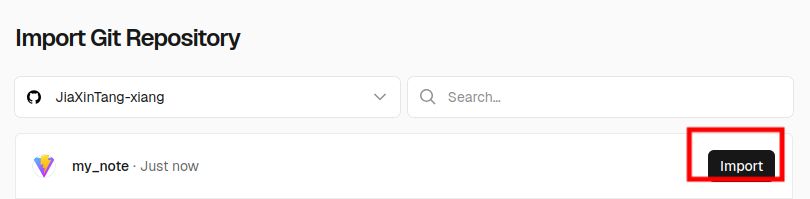
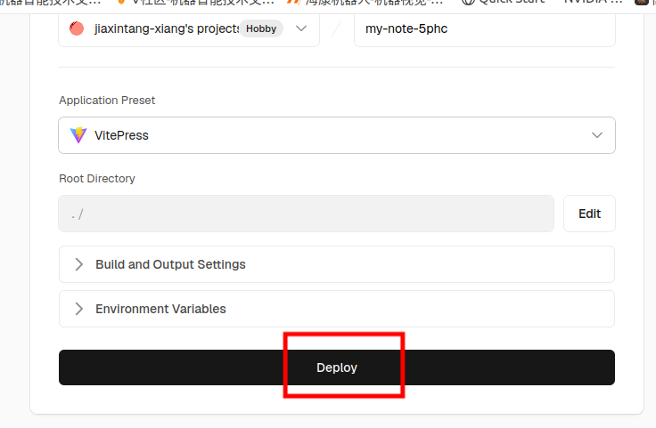
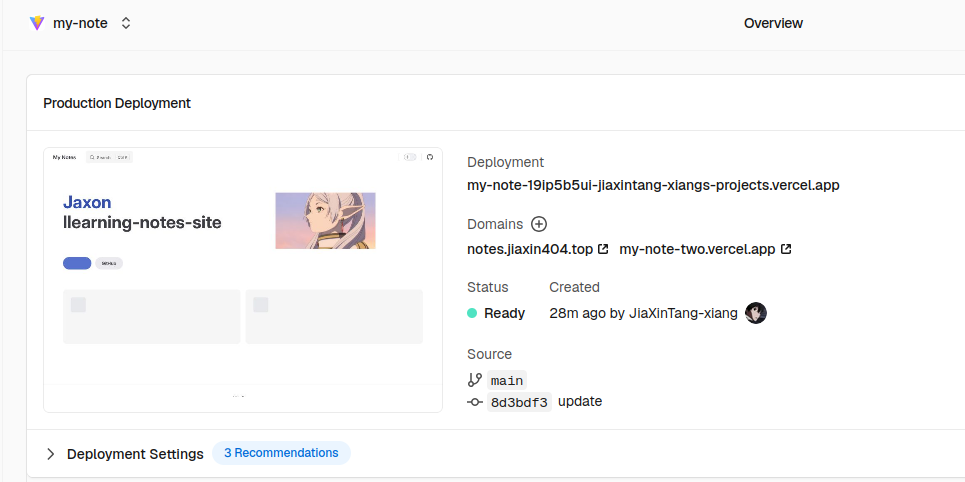
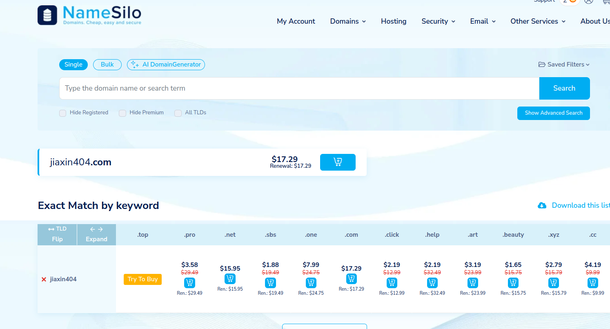
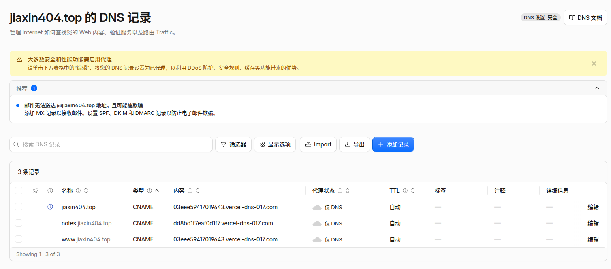
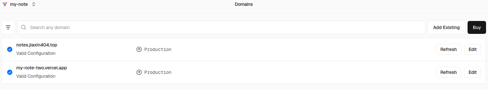

## 前言

继[个人博客](/tech/about-my-blog)之后，就想做一个搭建部署教程，同时记录一下以免自己忘记了，但总被各种事情耽搁。最近，看到有佬的个人笔记网站，萌生有搭一个人知识库的想法，趁现在期末周，腾出些时间弄了一下。
可见https://notes.jiaxin404.top/。

对于个人博客，网上有很多模版，选一个自己喜欢的，在此基础上开发，前人栽树后人乘凉嘛，但更多的人卡在了配置和部署上面，本文搭建 VitePress 过程和这些blog站点类似，可作为教程参考。

于是我决定搭一个**个人知识库 / 笔记站**，和博客分开：
| | 博客 | 知识库 |
|------|------|------|
| **定位** | 长文分享、思考感悟 | 学习笔记、技术备忘 |
| **内容** | 完整文章 | 知识点整理、Cheatsheet |
| **更新** | 不定期发文 | 边学边更新 |
| **风格** | 个人风格、有故事性 | 结构化、便于查阅 |

## 框架选择

因为我的博客用的是 Astro，笔记站不想重复造轮子。这次目标很明确：**开箱即用、专注内容**。
| 框架 | 特点 | 适合 |
|------|------|------|
| **VitePress** | Vite + Vue，极简，启动快 | 文档站、知识库 |
| **Docusaurus** | Facebook 出品，功能全 | 大型项目文档 |
| **VuePress** | VitePress 的前身 | 偏旧的文档项目 |
| **Hexo** | 老牌博客框架 | 博客 |

最终选了 **VitePress**，原因很简单：
1. **轻量** — `npm init vitepress@latest` 就完事了
2. **自动侧边栏** — 写 Markdown 自动生成导航，不用手动配路由
3. **内置搜索** — 开箱即用，不用额外接 Algolia
4. **长得好看** — 默认主题干净


## VitePress搭建过程

### 初始化项目

```bash
mkdir my-notes && cd my-notes
npm init vitepress@latest
```

初始化完就一个空壳，核心文件就两个：

```
docs/
├── .vitepress/
│   └── config.ts    # 侧边栏、导航、主题配置
└── index.md         # 首页
```

### 配置侧边栏

在 `config.ts` 里配置 `sidebar`，这就是文档站的灵魂——左侧那一列分类导航：

```typescript
sidebar: {
  '/notes/': [
    {
      text: '学习笔记',
      items: [
        { text: 'xxx', link: '/notes/xxx' },

      ],
    },
    {
      text: '工具',
      items: [
        { text: 'xxx', link: '/notes/xxx' },
      ],
    },
  ],
}
```

这样就分好了目录，之后每次新增笔记，在这里加一行链接就行，目录结构自动就有了。

日常使用：就是往 `docs/notes/` 下丢 Markdown 文件：

```bash
cd docs/notes/
vim react-hooks.md    # 写内容
```
然后在 `config.ts` 的 sidebar 里补一条链接，`git push`，结束。


## 部署

这次没选 GitHub Pages，选了 **Vercel** 来部署：

| 对比 | GitHub Pages | Vercel |
|------|------|------|
| 配置 | 需要写 Actions YAML | **零配置**，自动识别 VitePress |
| 访问速度 | 国内偶尔不稳 | 全球 CDN，更快 |
| HTTPS | 手动配 | 自动 |
| 适合场景 | 一个账号一个站 | 多项目多站 |


1. 在部署之前，先把本地代码推到 GitHub 仓库：

```bash
# 在 my-notes 目录下
git init
git add .
git commit -m "init vitepress"

# 去 GitHub 新建一个空仓库，然后推送
git remote add origin git@github.com:你的用户名/仓库名.git
git branch -M main
git push -u origin main
```

2. GitHub 授权 Vercel，登录后，在主面板点击 Add New… → Project

3. Import 仓库，找到你刚刚创建的网站仓库，点击旁边的 Import 按钮

4. Deploy，在Vercel 会自动识别你的项目是什么框架（Astro, Next.js, etc.），并帮你填好所有构建设置。你什么都不用改，直接点击 Deploy 按钮


5. 稍等片刻，Vercel网站就已经上线了！Vercel 会提供一个 .vercel.app 结尾的免费域名供你访问。


全程不需要写一行配置，Vercel 会自动检测到 VitePress。后面只需要在本地修改代码，然后 git push 到 GitHub，Vercel 就会自动拉取最新代码，重新构建和部署你的网站。完全自动化！


## 自定义子域名

1.购买域名
前往 NameSilo、GoDaddy 等域名注册商，购买一个你喜欢的域名。
我是在 NameSilo 购买的，后面以它为例：


我之前博客用的是 `jiaxin404.top`，所以这次笔记站用子域名 `notes.jiaxin404.top`。

买好域名后，只需要两步：

### 1. DNS 添加 CNAME 记录

虽然域名商也提供 DNS 解析，但 Cloudflare 提供免费的全球 CDN 加速和更强大的安全防护，所以我用的是 Cloudflare。在域名 DNS 后台添加
| 类型 | 名称 | 目标 |
|------|------|------|
| CNAME | `notes` | Vercel 分配的地址（如 `xxx.vercel.app`） |



**注意**：如果开启了 Cloudflare 代理（橙色云），这里要先把代理关掉（灰色云），否则 Vercel 没法验证。验证通过后再开回去即可。

这里我之前弄过 Cloudflare，所以只需要加一条 DNS 记录就行。

**如果你是从零开始，完整流程如下：**

1. 注册 [Cloudflare](https://dash.cloudflare.com/sign-up) 账号
2. 登录后点击 **Add a domain**，输入你购买的域名，选择 **Free** 方案（个人用完全够）
3. Cloudflare 会扫描现有 DNS 记录（新域名是空的），然后提示你更改 NameServer
4. 记下 Cloudflare 提供的两个 NameServer 地址
5. 回到域名注册商（如 NameSilo）的后台，找到 NameServer 设置，替换为 Cloudflare 提供的那两个地址
   - 例如 NameSilo：My Account → Domain Manager → 你的域名 → NameServers，删除默认的，填入 Cloudflare 的
6. 回到 Cloudflare，在 **SSL/TLS** 页面，加密模式设为 **Full (strict)**

### 2. Vercel 绑定域名

进入 Vercel 项目 → Settings → Domains → 输入 `notes.jiaxin404.top` → Add。



### 3. Cloudflare 加 CNAME 指向 Vercel

在 Cloudflare 的 DNS → Records，添加 CNAME 记录：
| 字段 | 值 |
|------|------|
| Type | `CNAME` |
| Name | `notes`（代表子域名前缀） |
| Target | Vercel 分配的地址（如 `xxx.vercel.app`） |
| Proxy status | Proxied（橙色云朵亮起） |

稍等片刻，DNS 生效后就能通过 `https://notes.jiaxin404.top` 访问了。

这跟 `juniortree.com` 分出 `note.juniortree.com` 是一个道理——子域名随便加，不需要额外买域名，一个域名可以分出无数个子域名。

## 域名到底怎么管

这里遇到一个小坑：我的 `jiaxin404.top` 是在 **NameSilo** 买的，但 DNS 解析托管在 **Cloudflare**。所以我在 NameSilo 加 DNS 记录没生效，因为实际解析权在 Cloudflare。

怎么判断 DNS 在哪管？随便查一个你的域名的 DNS 记录，看 NS（Name Server）指向哪家就知道。大部分人会选择把域名买和 DNS 解析分开——NameSilo 负责续费，Cloudflare 负责解析，各干各的。

## 最后的感受

博客 + 知识库，两个站加起来：

```
jiaxin404.top          → 博客（Astro + GitHub Pages）
notes.jiaxin404.top    → 知识库（VitePress + Vercel）
```

这样分工很清晰：博客写长文分享，知识库记学习笔记，互不干扰。

这次从搭框架到上线，加上绑域名，总共花了不到2个小时，毕竟之前VitePress 确实省心——没有花里胡哨的配置，打开就能写，写完 push 就更新。


希望这篇文章对你搭建自己的知识库有所帮助。

## 小结

技术是骨架，内容才是灵魂。先让它跑起来，坚持记录才是最重要的。希望我能继续坚持更新写下去。


