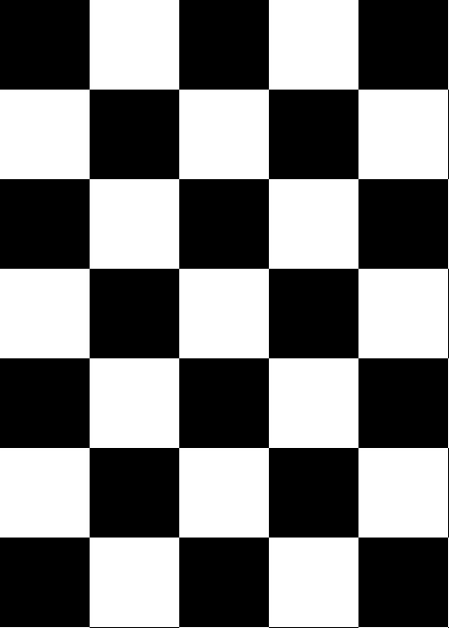

## 前言

相机标定是视觉 SLAM、深度估计、目标检测等任务的前置步骤——未标定的相机会引入桶形/枕形畸变，导致 3D 点云变形、建图歪斜。

常见的相机标定方法有几种：

- **OpenCV 标定**：使用 `cv2.calibrateCamera()`，灵活但需要手动写采集脚本，适合 Python/C++ 项目
- **张正友标定法（Zhang's Calibration）**：只需一张打印的棋盘格，就能获取相机的**内参矩阵**和**畸变系数**，是目前最通用的标定方法
- **Kalibr**：支持多相机 + IMU 联合标定，适用 SLAM/VIO 等高精度场景
- **Matlab Camera Calibrator**：图形化操作，适合快速验证和教学

本文记录张正友标定法在 ROS 2 Humble 下用 `camera_calibration` 包完成标定的全过程，底层实际调用的是 OpenCV 的同款算法。

## 原理简述

棋盘格上的方格边长已知，每个黑白交叉点的 3D 世界坐标也是已知的。摄像头从不同角度拍摄棋盘格 → 检测每张图片中的角点 → 建立 3D→2D 对应关系 → 解算相机内参和畸变参数。

## 1. 环境准备

```bash
# 安装依赖
sudo apt install ros-humble-camera-calibration \
  ros-humble-camera-calibration-parsers \
  ros-humble-camera-info-manager

# 安装 USB 摄像头驱动
sudo apt install ros-humble-usb-cam
/home/jiaxintang/桌面/my/picture/wallhaven-rqyv9w.jpg
# 如果 NumPy 版本冲突（2.x 与 cv_bridge 不兼容）
pip uninstall opencv-python -y
pip install "numpy<2" -i https://pypi.tuna.tsinghua.edu.cn/simple
```

## 2. 制作棋盘格标定板

打印一张黑白棋盘格。关键参数：

- **格子数**：7 列 × 5 行
- **方格边长**：2cm（20mm）
- `--size` 参数填的是**内角点数**，不是格子数——内角点 = (列-1) × (行-1) = **6×4**

> 内角点是黑白格子交叉的顶点，从外侧数：7 列 5 行的棋盘格，内角点为 6×4。



## 3. 启动摄像头

确认摄像头设备号：

```bash
ls /dev/video*
```

选择 USB 摄像头对应的设备（本例为 `/dev/video4`）：

```bash
source /opt/ros/humble/setup.bash
ros2 run usb_cam usb_cam_node_exe --ros-args -p video_device:=/dev/video4
```

摄像头正常启动后发布话题 `/image_raw`。验证：

```bash
ros2 topic hz /image_raw
# 输出约 30 Hz 即正常
```

## 4. 标定过程

打开**新终端**，启动标定 GUI：

```bash
source /opt/ros/humble/setup.bash
ros2 run camera_calibration cameracalibrator \
  --size 6x4 --square 0.02 \
  --ros-args -r image:=/image_raw -p camera:=/my_camera
```

参数说明：
- `--size 6x4`：内角点数（7 列 5 行棋盘格 → 6×4 内角）
- `--square 0.02`：每格边长 0.02 米（2cm）
- `--pattern`：标定板类型，可选 `chessboard`（默认）、`circles`、`acircles`、`charuco`
- `-r image:=/image_raw`：订阅摄像头话题
- `-p camera:=/my_camera`：服务命名空间

**可选优化参数：**

| 参数 | 说明 |
|------|------|
| `--fix-principal-point` | 固定光心到图像中心（cx, cy = 宽/2, 高/2） |
| `--fix-aspect-ratio` | 强制 fx = fy，适合像素近似正方形的相机 |
| `--zero-tangent-dist` | 切向畸变系数 p1, p2 归零，适合镜头对中较好的场景 |
| `-k N` | 径向畸变系数个数（默认 2，最多 6，需要更精确的畸变模型时可提高） |


## 5. 采集与进度条

将棋盘格在摄像头前**缓慢移动**，每类动作停留几秒等样本累积。

| 进度条 | 含义 | 操作方法 |
|------|------|------|
| **X Bar** | 水平方向覆盖 | 移到画面最左、最右 |
| **Y Bar** | 垂直方向覆盖 | 移到画面顶部、底部 |
| **Size Bar** | 远近覆盖 | 贴脸 → 拉到满屏 |
| **Skew Bar** | 倾斜角度覆盖 | 大幅度倾斜 30°+ |

采集约 40-50 个有效样本后，四根进度条全部变绿 → **CALIBRATE** 按钮亮起。

## 6. 保存结果

点击 **CALIBRATE** → 等待计算完成 → 点击 **SAVE**。

结果保存在 `/tmp/calibrationdata.tar.gz`，提取：

```bash
tar -xvf /tmp/calibrationdata.tar.gz -C ~/
```

得到 `ost.yaml`，包含完整的相机内参和畸变系数。

## 7. 标定结果解读

```yaml
image_width: 640
image_height: 480
camera_name: narrow_stereo
camera_matrix:
  data: [390.09,   0.   , 322.58,
           0.   , 520.27, 236.14,
           0.   ,   0.   ,   1.  ]
distortion_coefficients:
  data: [-0.4515, 0.1797, -0.0016, -0.0045, 0.0]
```

### 相机矩阵

| 参数 | 值 | 说明 |
|------|------|------|
| `fx` | 390.09 | X 轴焦距（像素单位） |
| `fy` | 520.27 | Y 轴焦距（像素单位） |
| `cx` | 322.58 | 光心 X 坐标 |
| `cy` | 236.14 | 光心 Y 坐标 |

`fx ≠ fy` 表明相机像素不是正方形（X/Y 缩放比不同），属于正常光学特性。

像素坐标与 3D 世界点的映射关系：

```
u = fx × X/Z + cx
v = fy × Y/Z + cy
```

### 畸变系数

| 系数 | 值 | 类型 |
|------|------|------|
| `k1` | -0.4515 | 二阶径向畸变 |
| `k2` | 0.1797 | 四阶径向畸变 |
| `p1` | -0.0016 | 切向畸变 |
| `p2` | -0.0045 | 切向畸变 |

`k1 = -0.45`（负值）说明相机有**明显的桶形畸变**——图像边缘的直线会向画面中心弯曲。这是广角镜头常见的特征。

## 8. 使用校准文件
### 方式一：自动加载

将校准文件放到 ROS 默认路径，`usb_cam` 启动时自动读取：

```bash
cp ost.yaml ~/.ros/camera_info/default_cam.yaml
```
### 方式二：显式指定

通过参数传入校准文件路径：

```bash
ros2 run usb_cam usb_cam_node_exe --ros-args \
  -p video_device:=/dev/video4 \
  -p camera_info_url:=file:///path/to/ost.yaml
```


## 底层实现：OpenCV 张正友标定法

ROS 2 的 `camera_calibration` 包内部调用的是 OpenCV 的同款标定函数。以下从零实现，展示完整的标定流程。

### 1. 寻找棋盘格角点 —— `findChessboardCorners()`

```cpp
bool cv::findChessboardCorners(
    InputArray  image,        // 输入图像
    Size        patternSize,  // 内角点数，如 (6, 4) 表示 7×5 的棋盘格
    OutputArray corners,      // 输出的角点坐标向量
    int         flags = CALIB_CB_ADAPTIVE_THRESH + CALIB_CB_NORMALIZE_IMAGE
);
```

首帧检测到棋盘格后，提取黑白交叉点的像素坐标，存入 `corners`。

### 2. 亚像素精化 —— `find4QuadCornerSubpix()`

```cpp
bool cv::find4QuadCornerSubpix(
    InputArray       img,         // 灰度图
    InputOutputArray corners,     // 输入粗糙角点，输出亚像素精化角点
    Size             region_size  // 搜索窗口大小，如 (5, 5)
);
```

`findChessboardCorners` 返回的角点精度在像素级，`find4QuadCornerSubpix` 在角点周围 `region_size` 区域内以亚像素精度重新逼近，显著提升标定精度。

### 3. 标定求解 —— `calibrateCamera()`

```cpp
double cv::calibrateCamera(
    InputArrayOfArrays  objectPoints,  // 世界坐标系中的角点 3D 位置
    InputArrayOfArrays  imagePoints,   // 像素坐标系中的角点 2D 位置
    Size                imageSize,     // 图像尺寸
    InputOutputArray    cameraMatrix,  // 输出：3×3 相机内参矩阵
    InputOutputArray    distCoeffs,    // 输出：1×5 畸变系数
    OutputArrayOfArrays rvecs,         // 各视角的旋转向量
    OutputArrayOfArrays tvecs,         // 各视角的平移向量
    int  flags = 0,
    TermCriteria criteria = TermCriteria(COUNT + EPS, 30, DBL_EPSILON)
);
// 返回值为重投影误差（RMS，越小越好）
```

已知 N 张图片中棋盘格角点的 3D→2D 对应关系，通过最小化重投影误差求解相机内参和畸变系数。**返回值就是要交作业的"重投影误差"。**

### 4. 完整实现

```cpp
#include <iostream>
#include <opencv2/opencv.hpp>

using namespace cv;

int main() {
    // === 修改这里：匹配你的棋盘格 ===
    const int   board_w = 6, board_h = 4;              // 内角点数（7×5 格子 → 6×4 内角）
    const int   board_n = board_w * board_h;           // 总内角数 24
    const float square_w = 20.0f, square_h = 20.0f;    // 单格边长 20mm
    const int   img_count = 40;                        // 标定图片数量
    // ===============================

    Size board_size(board_w, board_h);
    std::vector<Point2f> corners_buf;
    std::vector<std::vector<Point2f>> image_points;

    Mat gray_img, drawn_img;
    Size img_size;
    int successes = 0;

    // 步骤 1：逐张检测角点 + 亚像素精化
    for (int i = 0; i < img_count; i++) {
        Mat src = imread(std::to_string(i) + ".jpg");
        if (src.empty()) continue;

        if (successes == 0) img_size = src.size();

        bool found = findChessboardCorners(src, board_size, corners_buf);
        if (found && (int)corners_buf.size() == board_n) {
            successes++;
            cvtColor(src, gray_img, COLOR_BGR2GRAY);
            // 亚像素精化
            find4QuadCornerSubpix(gray_img, corners_buf, Size(5, 5));
            image_points.push_back(corners_buf);

            // 可视化角点标注
            drawn_img = src.clone();
            drawChessboardCorners(drawn_img, board_size, corners_buf, found);
            imshow("corners", drawn_img);
            waitKey(50);
        } else {
            std::cout << "image " << i << " failed to find all corners" << std::endl;
        }
        corners_buf.clear();
    }
    std::cout << successes << " useful images" << std::endl;

    // 步骤 2：构造棋盘格 3D 物理坐标（所有 Z=0，格子依次排列）
    std::vector<std::vector<Point3f>> object_points;
    std::vector<Point3f> obj_buf;

    for (int i = 0; i < successes; i++) {
        for (int j = 0; j < board_h; j++) {
            for (int k = 0; k < board_w; k++) {
                obj_buf.push_back(Point3f(k * square_w, j * square_h, 0));
            }
        }
        object_points.push_back(obj_buf);
        obj_buf.clear();
    }

    // 步骤 3：标定
    Mat camera_matrix(3, 3, CV_32FC1, Scalar::all(0));
    Mat dist_coeffs(1, 5, CV_32FC1, Scalar::all(0));
    std::vector<Mat> rvecs, tvecs;

    double rms = calibrateCamera(object_points, image_points, img_size,
                                 camera_matrix, dist_coeffs, rvecs, tvecs);

    std::cout << "重投影误差(RMS): " << rms  << std::endl;
    std::cout << "相机内参矩阵:"    << std::endl << camera_matrix << std::endl;
    std::cout << "畸变系数:"        << std::endl << dist_coeffs   << std::endl;
    return 0;
}
```

编译运行：

```bash
# 将标定图片放到同一目录，命名为 0.jpg ~ 39.jpg
g++ calibrate.cpp -o calibrate $(pkg-config --cflags --libs opencv4)
./calibrate
```

### 5. ROS 2 vs 手动 OpenCV 对比

| | `camera_calibration`（ROS 2） | `calibrateCamera()`（手动 OpenCV） |
|------|------|------|
| 采集方式 | 实时视频流自动采集，GUI 进度条反馈 | 手动拍照片，存成 `0.jpg ~ N.jpg` |
| 角点检测 | 内部调用 `findChessboardCorners` | 直接调用，完全控制参数 |
| 亚像素精化 | 内部做 | 显式调用 `find4QuadCornerSubpix` |
| 标定求解 | 同款 `calibrateCamera` | 同款 `calibrateCamera` |
| I/O | 自动保存 `ost.yaml` | 自己写文件输出 |
| 重投影误差 | 终端 `ost.yaml` 里 | 返回值 `rms` |
| 适用场景 | ROS 项目快速标定 | 独立项目、作业、嵌入式 |
| 底层本质 | **都是 OpenCV 张正友标定法** | |

学好手动版能真正理解标定内核：角点检测 → 亚像素精化 → 3D/2D 对应 → 最小化重投影误差求解。ROS 2 版就是把这套流程封装成了工程化工具。

## 小结

标定方法选型：

- **ROS 2 `camera_calibration`**：适合 ROS 项目，开箱即用，一秒上手
- **手动 OpenCV**：适合学习原理、独立项目、作业交付
- **Kalibr**：适合多相机 + IMU 联合标定
- **Matlab**：适合快速验证和教学演示

无论哪种工具，底层都是张正友标定法——打印棋盘格 → 多角度拍摄 → 3D/2D 对应 → OpenCV `calibrateCamera()` 求解。这个标定文件后续在视觉 SLAM、点云投影、双目深度估计等任务中都会用到——它是相机视觉任务的"出厂参数"。

参考：
[相机校准](https://docs.nav2.org/tutorials/docs/camera_calibration.html)